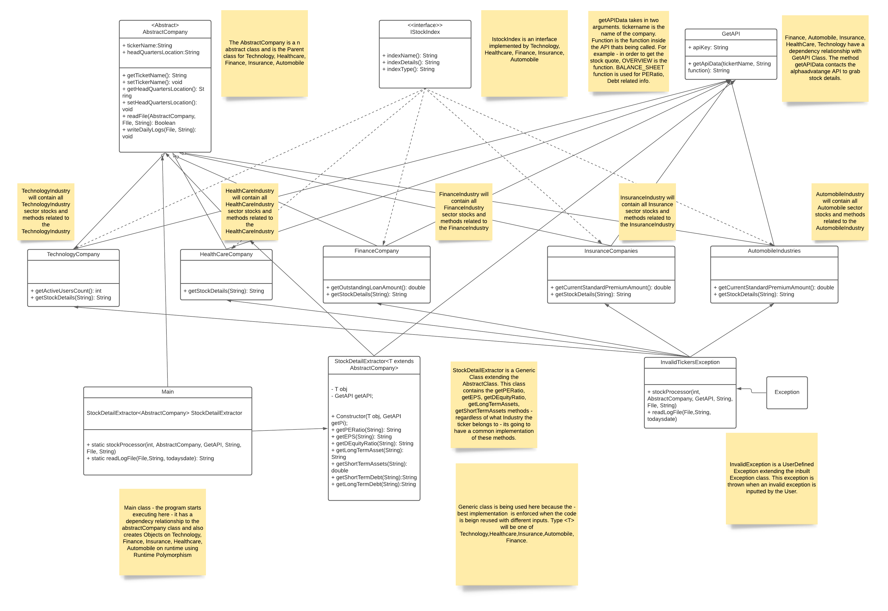

# SmartStockPicker

## How to run the Application ?

* The [com.smartpickers.stocks.Main](src/com/smartpickers/stocks/Main.java) contains the Main class of the program. 
* The Program doesnt require any input from the User at this point. However the application asks a bunch of Questions to the User to well satisfy the User Request

## What Test Cases are written 

* Check for HealthCare.txt file exisistence
* Check for Insurance.txt file exisistence
* Check for Technology.txt file exisistence
* Check for Automobile.txt file exisistence
* Check for Finance.txt file exisistence
* Check for DailyTickerLog.txt file exisistence
* Check if the UserDefinedException - InvalidTickerException is thrown
* Check if data is present in the Every Industry Ticker file

## How to Run Tests

* Test cases are present in the [com.smartpickers.tests](src/com/smartpickers/test/InputTest.java)
* Once the project is loaded in eclipse -  click on the [InputTest.java](src/com/smartpickers/test/InputTest.java) file
* Right click on the file and click Run as Junit Tests.
* Once the tests passes, the left panel should indicates the tests passing/failing.

## Functionalities Offered

There is a total of 3 functionalities to the SmartStockPicker Application.

*	Get a stock quote of any ticker that belongs to Technology, Finance, Insurance, Healthcare, Automobile Industry
*	Get the list of top 10 Stocks of an Industry
*	Compare two stocks and find a better buy of the two

## Sample Output 

Below is the sample output for the Smart Stock Picker Application. The Application responds to the User based on the Previous Inputs User has provided.

## Class Hierarchy and Model

Below Model explains the Class Heirarchy and the relationship between the classes. Please note that this model keeps progessing as the functionalities are added.

## External API Used 

In order to  grab stockmarket Data, alphavantage API has been consumed.  A key can be generated in the alphavantage website.

For more Documentation on the API - Please visit [Alpha Advantage Website](https://www.alphavantage.co/)
